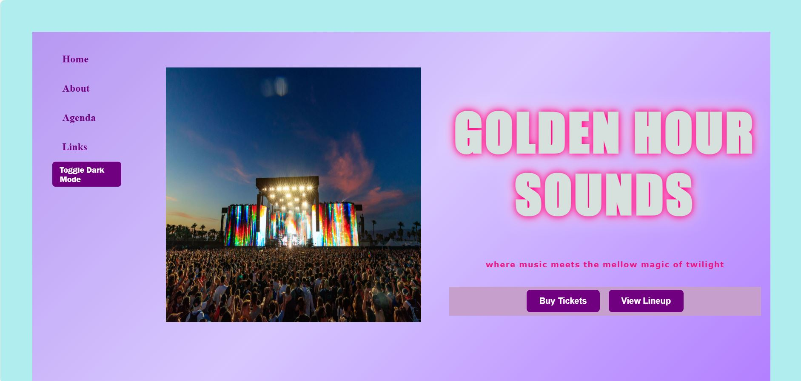

# 🎵 Golden Hour Sounds

**Golden Hour Sounds** is a vibrant, responsive web page designed to promote a fictional sunset music festival — where music meets the mellow magic of twilight. The project showcases **HTML**, **CSS**, and **JavaScript** fundamentals, including **dark mode toggling**, **dynamic DOM manipulation**, and **form validation**.

---

## 🌅 Overview
This project captures the essence of an immersive festival website. It highlights event details, artist lineups, interactive RSVP features, and links for music lovers and dreamers. The goal is to merge **design**, **interactivity**, and **accessibility** into one smooth experience.

---

## ✨ Features
- 🎨 **Interactive Navigation Bar** – Highlights active links  
- 🌙 **Dark Mode Toggle** – Switch between light and dark themes  
- 📝 **RSVP Form with Validation** – Dynamically adds new participants  
- 📱 **Responsive Design** – Works across devices  
- 🎥 **Embedded Media** – YouTube video integration  
- 🎶 **Event Schedule & Highlights** – Realistic festival lineup  

---

## 🧠 Technologies Used
- **HTML5** – Semantic structure and layout  
- **CSS3** – Styling, transitions, and responsive design  
- **JavaScript (ES6)** – DOM manipulation and logic handling  
- **YAML** – Configuration and environment setup  

---

## 🚀 How to Run

1. Clone this repository:
   ```bash
   git clone https://github.com/Yaminiiii7/musicEventFestival.git
   ```
2. Navigate to the project folder:
   ```bash
   cd musicEventFestival
   ```
3. Open `index.html` in your preferred browser.

---

## 💡 Future Enhancements
- Add RSVP success modals and smooth animations  
- Store RSVP data with a simple backend  
- Optimize for mobile-first responsiveness  

---

## 📸 Project Preview


---

## 🖋️ Author
**YAMINI**  
  

If you like this project, give it a ⭐ on GitHub!  

---
